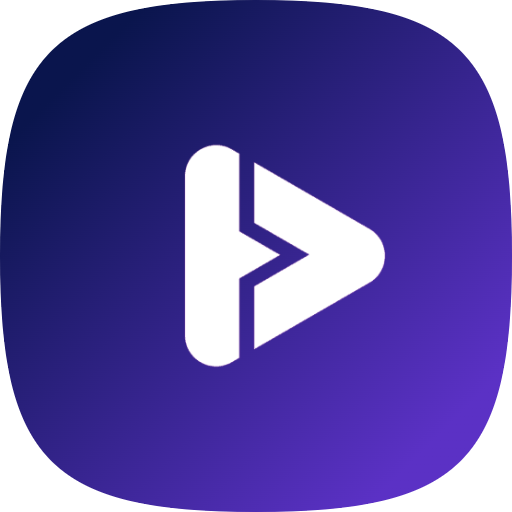

  <h1>Mouvee</h1>
  
<b>Final project 4 - Kelompok 1</b>

  
Website ini merupakan Final projek akhir dari Hacktiv8 kelas React. Aplikasi yang dibuat pada Final project ini adalah website Film dikembangkan dengan menggunakan framework NextJS dan TailwindCSS serta Zustand dan Firebase sebagai state/backend management-nya. Kemudian Website ini dibuat dengan sistem desain Glassmorphism, dan sudah berbasis PWA.

 

----

## Panduan Aplikasi dari Sisi Pengguna (User Guide) 📒
Halaman berikut hanya bisa diakses oleh user yang sudah login. Jika belum login, maka akan diarahkan ke halaman login. 

Pada halaman login, pengguna dapat login dengan mengisi form login dengan email dan password.

    // Dapat menggunakan akun dibawah ini
    email: user@mouvee.com
    password: user123

Jika pengguna belum memiliki akun, maka pengguna dapat mendaftar dengan mengisi form register dengan email dan password.

 

***

### 1. Halaman Utama (Home) 🏠

Halaman utama adalah halaman yang pertama kali muncul ketika pengguna membuka aplikasi. Halaman ini berisi Welcome Hero Section, Top Product Bestseller, Category, dan CTA card section berdasakan kategory. Pengguna dapat melihat melihat detail produk, dan menambahkan produk ke keranjang belanja dengan ketentuan harus login sebagai user terlebih dahulu.

 

### 2. Halaman Kategori (Category) 🗒️
Secara default halaman ini akan menampilkan daftar film dengan kategori Action. Pengguna dapat mengubah kategori film yang ditampilkan dengan mengklik salah satu kategori yang ada di Header Tab. Terdapat juga pagination untuk menampilkan daftar film yang lebih banyak.

 

### 3. Halaman Detail Film (Movie Detail) 📜
Halaman ini muncul ketika pengguna mengklik salah satu film pada icon link detail Card Item. Halaman ini berisi informasi mengenai film yang dipilih beserta film sejenis. 

 

### 4. Halaman/Modal Film (Movie modal) 🛒
Halaman/Modal ini muncul ketika tombol Play pada Card Item diklik. Halaman ini berisi informasi mengenai film yang dipilih termasuk Trailer dan Deskripsi. Pengguna dapat menambahkan film ke Watchlist dengan mengklik icon-nya.

 

### 5. Halaman Watchlist (Watchlist) 🗄️
Halaman ini muncul ketika tombol Watchlist di navbar diklik. Halaman ini berisi daftar film yang telah ditambahkan ke Watchlist. Pengguna dapat menghapus film dari Watchlist dengan mengklik icon-nya.

 

### 6. Halaman Hasil Pencarian (Search Result) 🔍
Halaman ini muncul ketika pengguna melakukan pencarian film. Halaman ini berisi daftar film yang sesuai dengan kata kunci pencarian.

### 7. Halaman About Dev (About Dev) 👨‍💻 
Halaman ini berada di footer web app. Halaman ini berisi informasi mengenai developer dan info secara singkat pada proses management pengembangan web.

### 8. Halaman Tidak Ditemukan (404) 🚫
Halaman ini muncul ketika pengguna mengakses halaman yang tidak ada. Halaman ini berisi informasi mengenai halaman yang tidak ditemukan.

 

* Note: *Kedepannya akan dilakukan pengembangan lebih lanjut terkait project web app ini. Terima kasih.*

[Silahkan lihat panduan terkhusus bagi Reviewer dan Developer di link ini](./docs)

