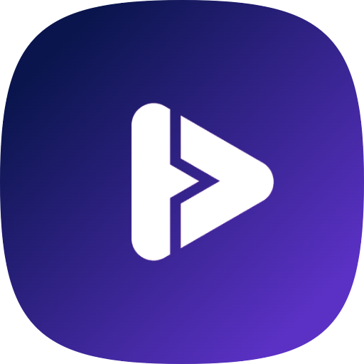

<div align="center">

  <h1>Mouvee</h1>
  <p><b>Final project 4 - Kelompok 1</b></p>
</div>
<br/>

## Tentang Aplikasi 📖
1. Konsep design yang digunakan: Glassmorphism dengan dasar warna hitam beserta ungu gradient sebagai tambahan.
2. Font : Inter.
3. Menggunakan strategi data fetching SSR(Server side rendering) untuk produk dan hanya dilakukan sekali, disimpan ke store dan digunakan kesemua halaman atau komponen. Jadi tidak perlu melakukan fetch data lagi ke API misalnya untuk tampilan detail produk dan kategori.
3. Halaman: Home, Category, detail movie, Watchlist dan 404 serta About Dev sebagai tambahan.
4. Modal: Movie overview.
5. Fitur Komponen wajib: (Mengikuti [Instruksi](https://) dari Hacktiv8)
6. Fitur Komponen tambahan: Animation Loader Page, Tab kategory, Responsive, PWA, tambahan beberapa hero section di home page, compress output image, optimasi SEO, dan beberapa fitur lainnya.

    Note    
    - Secara garis besar inspirasi desainnya berasal dari Netflix dan NextUI.
    - Nama Brandnya diambil dari kata Movie dan dimodifikasi menjadi '**Mouvee**'.
    - Logo yang diterapkan dengan bentuk icon Play dan garis dari ornamen nama brand.


---
<br/>

&nbsp;


<p align="left">Selasa, 14 Desember 2022 | 13:15 - 14.15 WIB</p>

* Instruktur oleh Bpk. Arif Setiawan
## 👨‍💻 Member
* Muhaemin Iskandar     (RCTN-KS05-001)


## ⚡Presentasi
    
1.  Management Project Trello ✅
2.  Panduan Penggunaan ✅
3.  <details>
    <summary>Coding ✅ </summary>
    <ul>
    <li>Setup code</li>
    <li>Install Library</li>
    <li>Structur Projek</li>
    <li>Component</li>
    <li>Page</li>
    <li>Database - (Cloud & Local Storage)</li>
    </ul>
    </details>
6. Demo Aplikasi ✅  


## 📝 Dokumentasi
- [x] [Panduan](https://docs.google.com/document/d/1uUsQeogPofHuZKZImht6rHSd8eYoq30qJJ2uJZkKeAs/edit?usp=sharing)
- [x] [Trello](https://trello.com/b/xqVl8ofw/kanban-movies)


----
<br/>

## Panduan untuk Developer 🧑‍💻

Pertama, Install NextJS dan semua dependensi yang dibutuhkan.

- (Ini dilakukan jika membuat project baru)

```bash
npx create-next-app
# atau
yarn create next-app
# atau
pnpm create next-app
```
- Masukkan nama project dan pilih template yang akan digunakan ketika diminta.
- Install dependensi yang dibutuhkan

```bash
yarn add <nama-package>
```
- Masuk ke direktori project dan jalankan server development.
```bash
cd <nama project>
yarn run dev
```
- Jika ingin menjalankan server production, jalankan perintah berikut.
```bash
yarn run build
yarn start
```

---

## Panduan untuk Kontributor 🤝

- Fork/Clone repository ini.
- Masukkan pada CLI.
```bash
git clone <link-repo>
```
- Install semua dependensi sesuai project ini dengan perintah berikut.
```bash
yarn install
```
- Silahkan lakukan pengembangan pada project ini.
- Buat branch baru untuk mengerjakan fitur baru.
```bash
git checkout -b <nama-branch>
```
- Setelah selesai mengerjakan fitur, lakukan commit dan push ke branch yang telah dibuat.
```bash
git add .
git commit -m "<pesan commit>"
git push origin <nama-branch>
```
- Buat pull request ke branch `main` dari repository ini.
- Tunggu sampai pull request disetujui dan di-merge.


---
<br/>

## Top Technology 🚀
<div align="left"> 

 
  


</div>

---
<br/>

## Learn More

To learn more about Next.js, take a look at the following resources:

- [Next.js Documentation](https://nextjs.org/docs) - learn about Next.js features and API.
- [Learn Next.js](https://nextjs.org/learn) - an interactive Next.js tutorial.

You can check out [the Next.js GitHub repository](https://github.com/vercel/next.js/) - your feedback and contributions are welcome!

